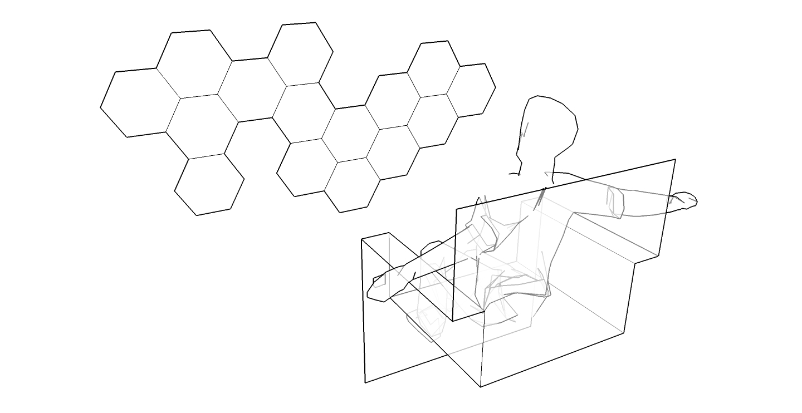
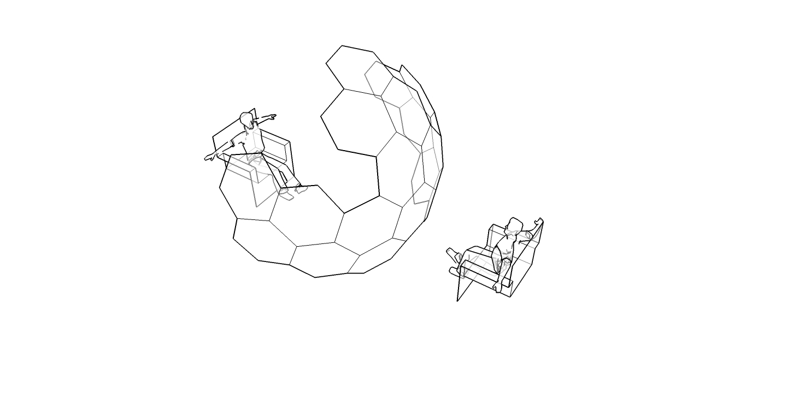
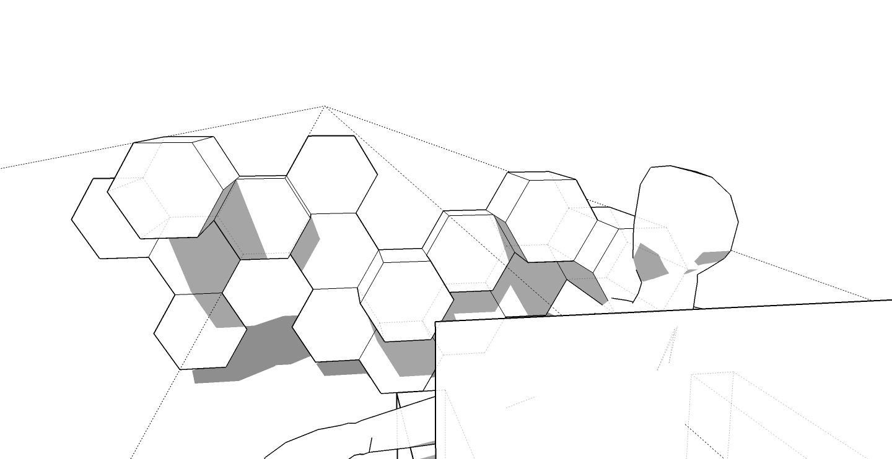
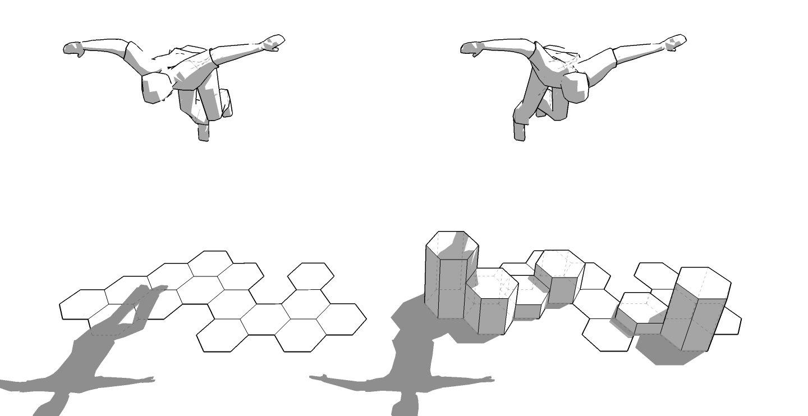
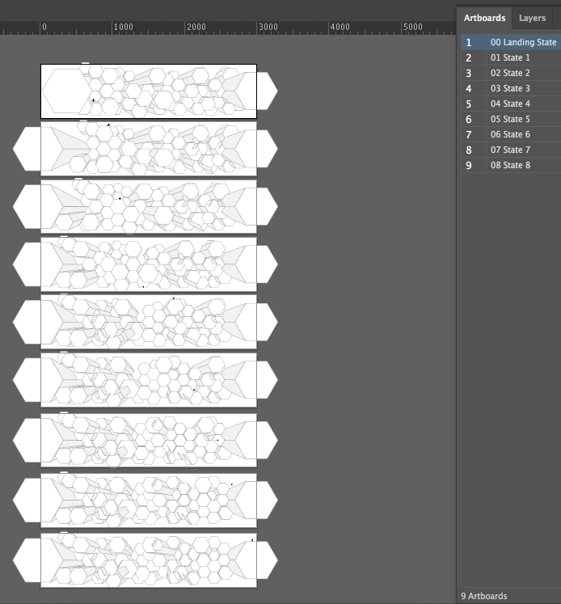
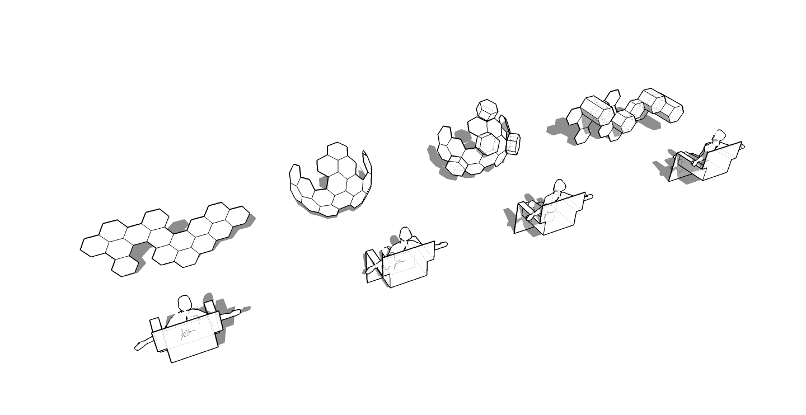

# aartics_portfolio

For this design portfolio, I undertook making a 3D representation of a gallery of my projects, viewed as if in a VR world.

This article consists of two sections:
1. Visualizing three dimensional panoramas - the concept behind the website and the thought process
2. Recipe for making a 3D perspective interaction experience in a desktop browser - the "how-to"

# 1. Visualizing three dimensional panoramas:

I started with a hexagonal grid to be able to extend the exploration in 6 directions instead of 4.

The homepage banner of d3js.org has an inspiring taste of how beautifully expansive that could feel.

A hexagonal grid could also allow ‘folding’ the design exploration pattern into spherical geodesic dome worlds of information.

This enabled me to imagine viewers experiencing equally sized tiles in a panoramic dome, and not restricted to traditional rectangular view-boxes (like this web browser we are reading this article on). Viewing from inside the dome (panorama) limits a user’s view, so I decided to explore viewing from the outside like a bir (inverse panorama).

Information of various types and hierarchies (ordinal and quantitative data) can be visualized as heights of the polygons. 

I visualized the panoramic bird’s eye view interaction with such a 3D interface for my website. 

[Experience the working interaction here: aartics.com](http://www.aartics.com "aarti's 3D portfolio")

# 2. Recipe for making a 3D perspective interaction experience in a desktop browser:

### Ingredients: SketchUP Make, Adobe PhotoShop + Illustrator, HTML, CSS, JavaScript (jQuery library and jInvertScroll plugin).

#### 1. Drawing the objects in perspective location and shadows:

I made the 3D object representation in SketchUP Make. For my design, this is a hexagonal columnar grid. 

I exported screenshots of the “bird’s eye view” camera perspective of the model: 

I stitched the screenshots in PhotoShop for a continuous panoramic effect.

I used the images in html with the jInvertScroll library to change the image based on the position of the cursor on the page.

[Click here to see the work-in-progress wireframe prototype.](http://www.aartics.com/projects/aartics_concept/ "Wireframes")

#### 2. Converting the shapes and shadows from the panoramic shots to vector graphics:

What I describe here is a very tedious way to achieve the vector conversion, and I am currently looking for better ways to export the 3D model directly to SVGs. Meanwhile, here is the description of what I did.

I laid out 9 states of the 3D panorama in Adobe Illustrator on individual artboards and illustrated the shapes and shadows as polygons for every state. Care was taken to ensure that each artboard contains the same layer name for individual polygons.

I then exported all the artboards as individual SVGs from Illustrator.

#### 3. The magical browser interaction:

Studying the structure of the SVG shows that each polygon is stored with a “points” attribute which is an array of numbers and each state of the panorama is a different set of numbers.

##### Now the question is — how can we make the polygons morph from one shape to another in the browser based on the viewer’s location?

With the help of my friend, philosopher and programmer extraordinaire guide Doug, we wrote a script that will store the points value for each polygon as arrays objects in JSON.

We then used vanilla JavaScript to update the values of the points attribute for each polygon in an initialized SVG based on the position of the cursor on the page. To achieve the horizontal panning effect on the page, I used the jInvertScroll library to retrieve the cursor position value, but this is not needed.

[Experience the working interaction here: aartics.com](http://www.aartics.com "aarti's 3D portfolio")

------------------

Thanks to this design exercise, we now have an animation framework to morph Illustrator graphics to interactive HTML. 
This allows us to imagine and prototype 3D visual interactions in 2D tools and traditional browsers. There are many improvements to be made, and as time goes on, I hope to present more examples and improved versions of this framework.

The code used for aartics.com is open source, and available here on GitHub.

#### Reference on Hexagonal Grids
I continue to study the applications of using hexagonal grids. This is one of the best references I have found:
http://www.redblobgames.com/grids/hexagons/#map-storage

